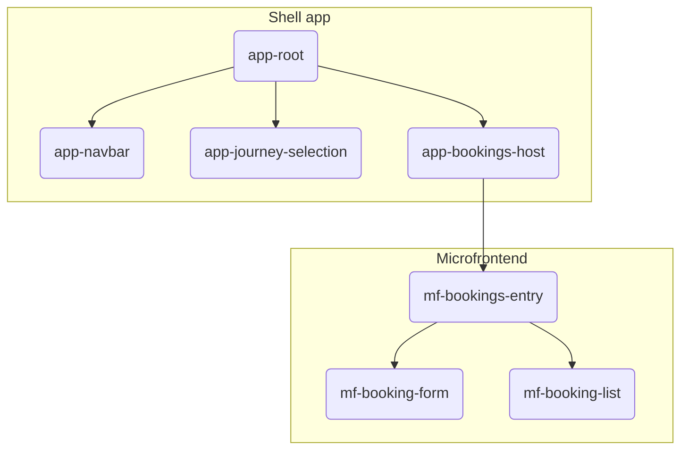
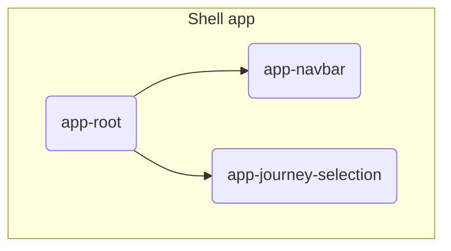
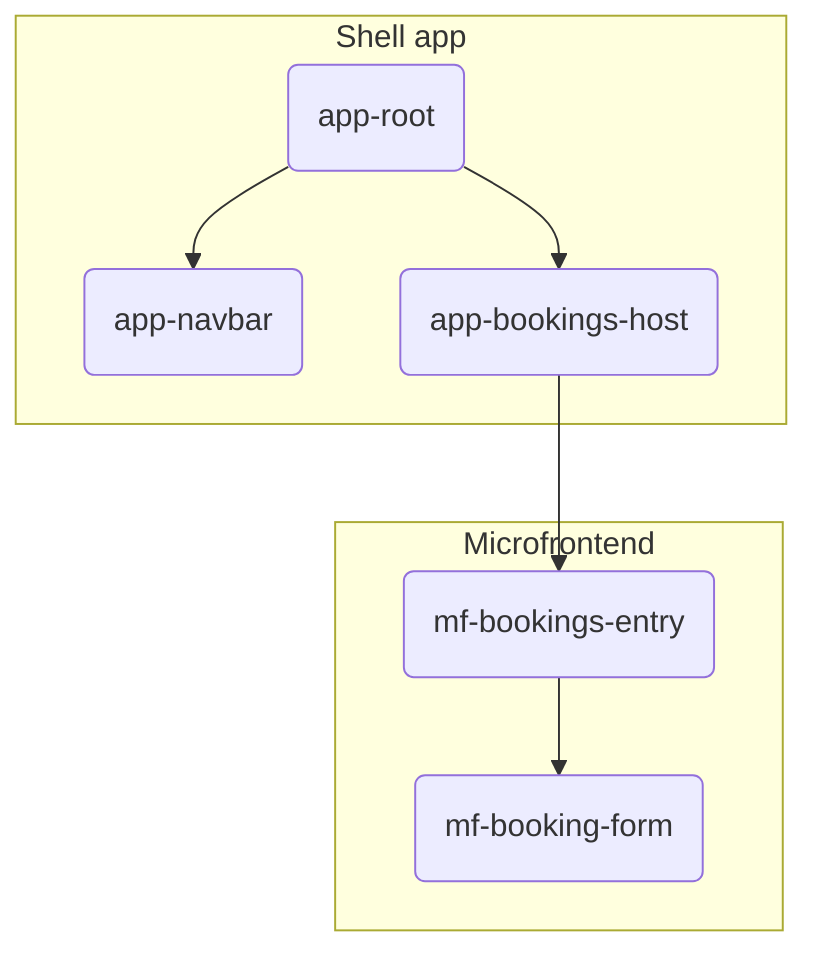
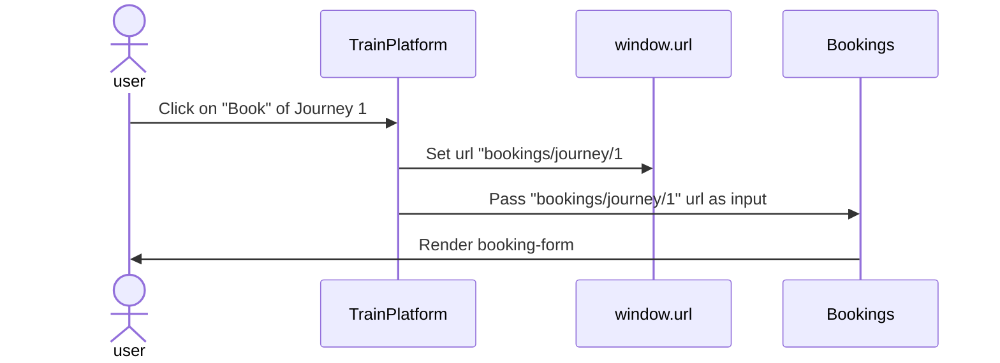
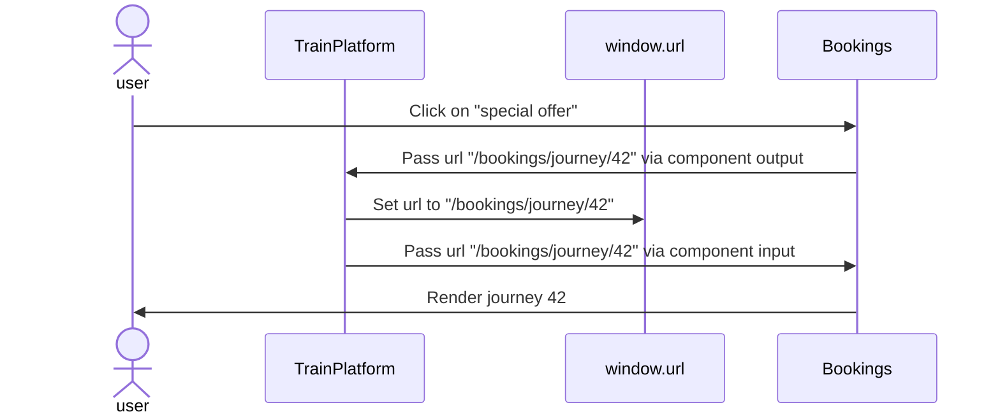
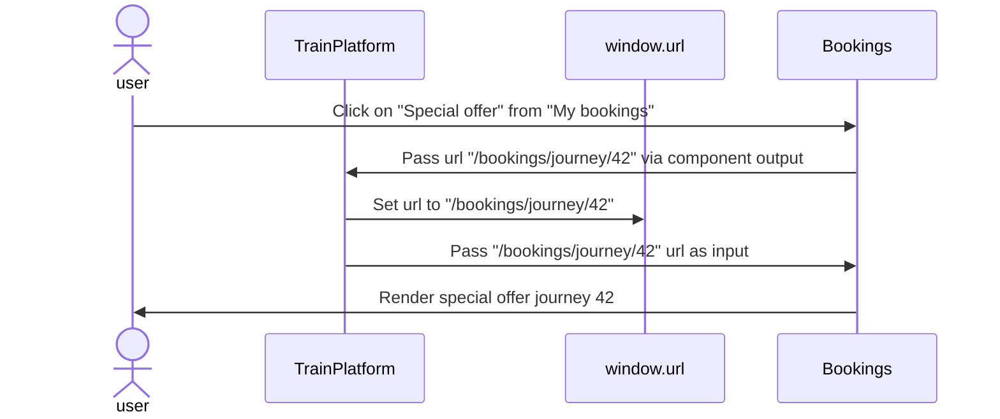

- Platform: [](https://app.netlify.com/sites/jolly-cobbler-bab33d/deploys)
- Microfrontend: [](https://app.netlify.com/sites/curious-bublanina-10c9c8/deploys)

# Microfrontends with Angular

```
$ git clone https://github.com/fboeller/microfrontends-with-angular.git
$ cd microfrontends-with-angular
$ npm install
$ npm start
```

A visit to `localhost:4200` shows the application.

## Serving the microfrontend inside the shell application locally

Execute these two commands in two shells:

```
$ npm start train-platform
```

```
$ npm run ng run bookings:build:local-web-components && npx http-server projects/bookings/dist --port 4201
```

## Environments

### Local

- Platform: Off
- Microfrontend: `http://localhost:4200/`
- Platform-Translations: Off
- Microfrontend-Translations: `http://localhost:4200/assets/i18n/<lang>.json`

### Production

- Platform: `https://my.domain.net/`
- Microfrontend: `https://my.domain.net/frontends/<frontend>/`
- Platform-Translations: `https://my.domain.net/assets/i18n/<lang>.json`
- Microfrontend-Translations: `https://my.domain.net/frontends/<frontend>/assets/i18n/<lang>.json`

### Local Web Components

Redirect: `http://localhost:4200/frontends/<frontend>/` -> `http://localhost:4201/`

- Platform: `http://localhost:4200/`
- Microfrontend: `http://localhost:4201/`
- Platform-Translations: `http://localhost:4200/assets/i18n/<lang>.json`
- Microfrontend-Translations: `http://localhost:4201/assets/i18n/<lang>.json`


## Fancy diagrams

### Component hierarchies



### Main page
No microfrontend is loaded on this page.



### Booking form page
This diagram shows all the Angular components that are rendered on the booking form page and illustrates which components are exposed by the shell application and which by the bookings microfrontend.



### My bookings page
This diagram shows all the Angular components that are rendered on the booking form page and illustrates which components are exposed by the shell application and which by the bookings microfrontend.


### User clicks on "Book" of Journey 1

### User clicks on "Special Offer" from "My bookings"


### User clicks on "Special offer" from "My bookings"
